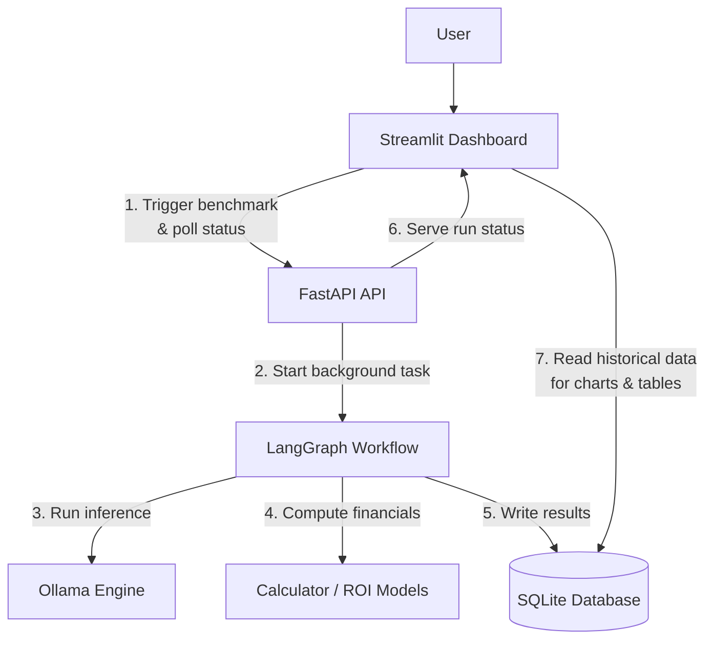

# ModelEval ROI Engine

A benchmarking and financial analysis tool for local LLM inference, evaluating model performance and comparing on premise cluster costs against cloud API pricing.

---

## Overview

This project helps answer a practical question: *At what request volume does running a model on your own hardware become cheaper than using a paid cloud API?*

It does this by:

- Running a retrieval‑based benchmark (paragraph selection) on any Ollama‑compatible model.
- Measuring accuracy (F1), latency (TTFT, TPS), and token usage.
- Simulating cloud costs using configurable per‑token pricing.
- Modeling hardware TCO (Total Cost of Ownership) for a user‑defined GPU cluster.
- Calculating breakeven points and capacity (max RPS) to inform deployment decisions.

The system provides a FastAPI backend, a Streamlit dashboard for interaction and visualisation, and a SQLite database for storing historical runs.

---

## Architecture



The evaluation workflow is implemented as a stateful LangGraph, handling multiple models sequentially (because I could not use parallel on my laptop GPU) with progress tracking and error recovery.

---

## Features

- **Multi‑model benchmarking** – test any model available in your Ollama instance.
- **Retrieval‑augmented task** – models must classify paragraphs into 8 categories
- **Hardware modelling** – define cluster specifications (GPU count, VRAM, power draw, admin overhead) to compute monthly TCO.
- **Cloud cost simulation** – use fictional per‑1k‑token pricing (input/output) to estimate API costs.
- **Breakeven & capacity analysis** – determine the monthly request volume at which the cluster becomes cheaper, and check if the cluster can handle a target RPS.
- **Interactive dashboard** – monitor progress in real time, view accuracy/latency/throughput charts, and inspect category‑level performance.
- **Executive summary** – optionally generate a summary via OpenRouter (with a fallback rule‑based synthesizer).

---

## Quick Start

### Prerequisites

- Python 3.11+
- [Ollama](https://ollama.ai) installed and running (with at least one model pulled, e.g. `ollama pull gemma2:2b`) 
- (Optional) An OpenRouter API key for LLM‑generated summaries

### Installation

```bash
git clone https://github.com/yourusername/model-eval-roi-engine.git
cd model-eval-roi-engine
python -m venv venv
source venv/bin/activate  # or `venv\Scripts\activate` on Windows
pip install -r requirements.txt
```

Create a `.env` file (copy from `.env.example`) with your settings:

```env
OLLAMA_HOST=http://localhost:11434
OPENROUTER_API_KEY=sk-or-v1-...  # optional
```

### Running Locally

Start the API server:

```bash
uvicorn app.main:app --reload --host 0.0.0.0 --port 8000
```

In another terminal, start the dashboard:

```bash
streamlit run ui/dashboard.py
```

Visit `http://localhost:8501` to use the interface.

### Using Docker Compose

```bash
docker compose up -d
```

The API will be available at `http://localhost:8000` and the dashboard at `http://localhost:8501`.

### Running a Benchmark

1. In the dashboard sidebar, select one or more models (they must be already pulled in Ollama (and also add it in config.py).
2. Configure your hardware cluster (GPU count, VRAM, power draw, etc.) and target RPS.
3. Click **Execute Benchmark**.
4. Watch the progress bar update as each model is evaluated.
5. Once complete, the dashboard will refresh and display the results.

---

## How It Works

### Benchmark Task

The engine uses a custom dataset of queries paired with 10 paragraphs (numbered 0‑9). Each test case has a set of ground‑truth relevant paragraph indices.

- The model receives a system prompt instructing it to return a JSON object like `{"indices": [1, 4, 7]}`.
- The response is parsed, and Precision/Recall/F1 are computed against the expected indices.
- Aggregated metrics (average F1, average latency, TTFT, TPS) are reported per model.

### Financial Model

**Cluster TCO (monthly):**
```
hardware_cost = upfront_cost / lifespan_months
electricity_cost = power_draw_kW * 730 hours * electricity_rate
labor_cost = admin_hours * hourly_rate
tco = hardware_cost + electricity_cost + labor_cost
```

**Cloud cost (per request):**
```
cost = (input_tokens * input_rate_per_1k + output_tokens * output_rate_per_1k) / 1000
```

**Breakeven:**
```
breakeven_requests = tco / cloud_cost_per_request
```

**Throughput:**
```
models_per_gpu = floor((gpu_vram * vram_headroom) / model_vram)
total_models = models_per_gpu * gpu_count
max_rps = total_models * single_instance_rps
```

---

## Testing

The project includes a comprehensive test suite (over 180 tests) covering all modules:

```bash
pytest tests/ -v
```

Run with coverage:

```bash
pytest --cov=app --cov-report=term-missing
```

---

## Technology Stack

- **API**: FastAPI (async, OpenAPI, Pydantic v2)
- **Workflow**: LangGraph (stateful orchestration)
- **Frontend**: Streamlit + Plotly
- **LLM Runtime**: Ollama (local inference)
- **Optional LLM Synthesis**: OpenRouter
- **Database**: SQLite
- **Containerisation**: Docker, Docker Compose
- **Testing**: Pytest, pytest‑asyncio, pytest‑cov

---

## Project Structure

```
.
├── app/
│   ├── main.py           # FastAPI endpoints
│   ├── config.py         # Pydantic settings & model registry
│   ├── calculator.py     # TCO, throughput, ROI calculations
│   ├── workflow.py       # LangGraph evaluation pipeline
│   ├── engine.py         # Ollama inference and parsing
│   ├── db.py             # SQLite schema and persistence
│   └── schemas.py        # Request/response models
├── ui/
│   └── dashboard.py      # Streamlit dashboard
├── data/
│   ├── test_cases.json   # Benchmark dataset
│   └── benchmark_history.db  # (auto‑created)
├── tests/                # Unit tests for each module
├── docker-compose.yml
├── Dockerfile
├── requirements.txt
├── .env.example
└── README.md
```

